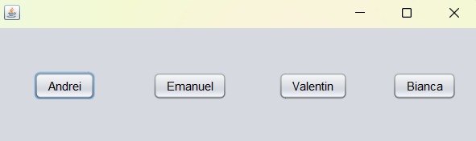
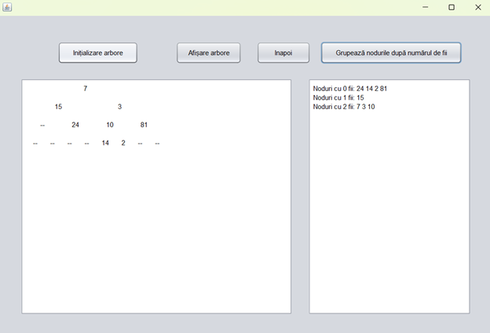
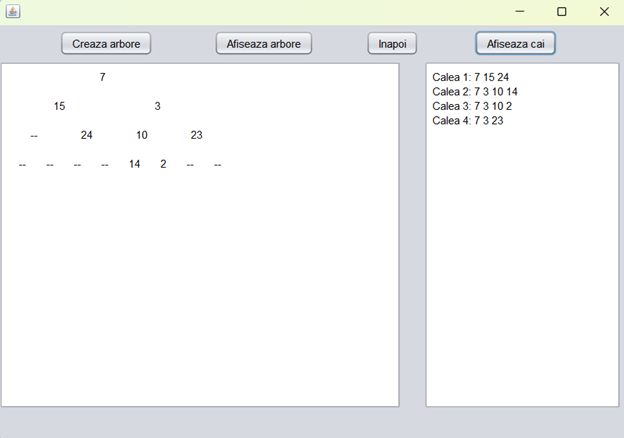
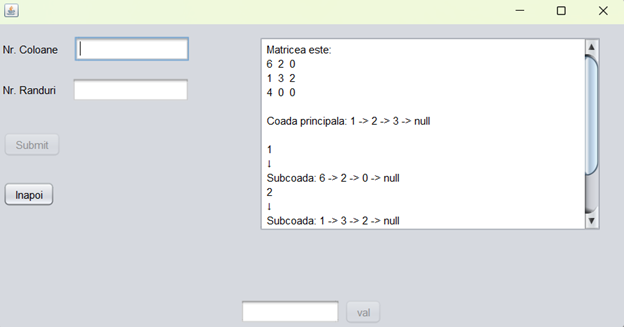

# Java_Data_Structure_Application

A collaborative Software Engineering project developed by 3rd-year Computer Science students at the Petroleum-Gas University of Ploiesti. This application integrates four distinct data structure problems into a single, intuitive Java Swing GUI.

## Overview

The core objective of this project was to implement complex data structures (Binary Trees, Queues, Linked Lists) from scratch, without relying on the standard `java.util.Collections` library. The project follows a modular architecture, focusing on the "Waterfall" development model and procedural programming paradigm.

### Key Features & Modules

*   **Queue of Queues (Valentin):** Converts a matrix into a hierarchical queue structure.
*   **Set Operations (Bianca):** Performs Union (Tree-based) and Intersection (Queue-based) between two sets.
*   **Node Classification (Andrei):** Analyzes and categorizes binary tree nodes based on their number of children (0, 1, or 2).
*   **Root-to-Leaf Paths (Emanuel):** Identifies and displays all possible paths from the root to the leaves in a binary tree.

## Screenshots

| | | |
|:---:|:---:|:---:|
|  |  |  |
| *Main Interface* | *Node Classification* | *Root-to-Leaf Paths* |

| | |
|:---:|:---:|
|  |  |
| *Queue of Queues* | *Set Operations* |

## Technical Stack

*   **Language:** Java
*   **GUI Framework:** Java Swing (JFC)
*   **IDE:** NetBeans
*   **Architecture:** Modular (Low-level manual DS implementation)

## Documentation

The project includes a comprehensive 35-page technical report covering system requirements, design patterns, testing scenarios, and user guides.

> **Note:** For more detailed information, technical specifications, and implementation logic, please check the **[Romanian Documentation](https://github.com/emanuelco07/Java_Data_Structure_Application/blob/main/Documentatie_ISW.pdf)** included in this repository.

## Contributors

*   **Cosereanu Emanuel** - Project Manager & Developer
*   **Craciun Elena Bianca** - Developer
*   **Gheorghe Valentin Marian** - Developer
*   **Vasile Andrei Daniel** - Developer

## Requirements

*   Java Runtime Environment (JRE) / JDK 21 or higher.
*   Minimum 4GB RAM and a display resolution of 1024x768.
